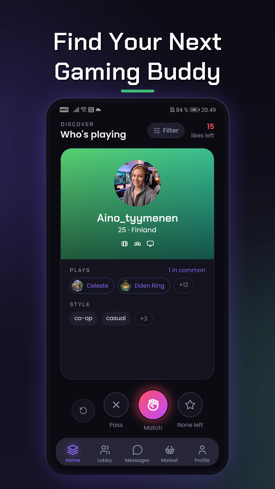
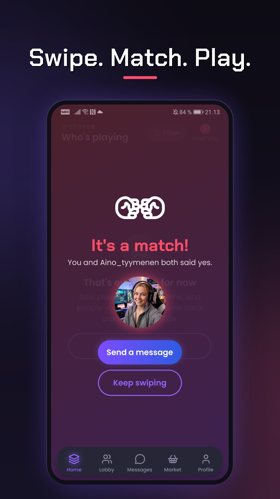
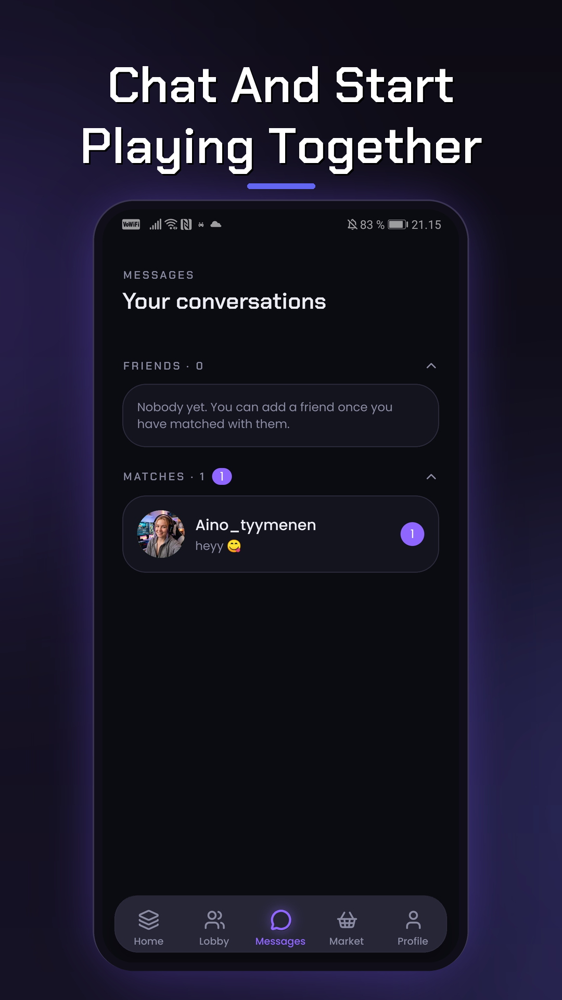
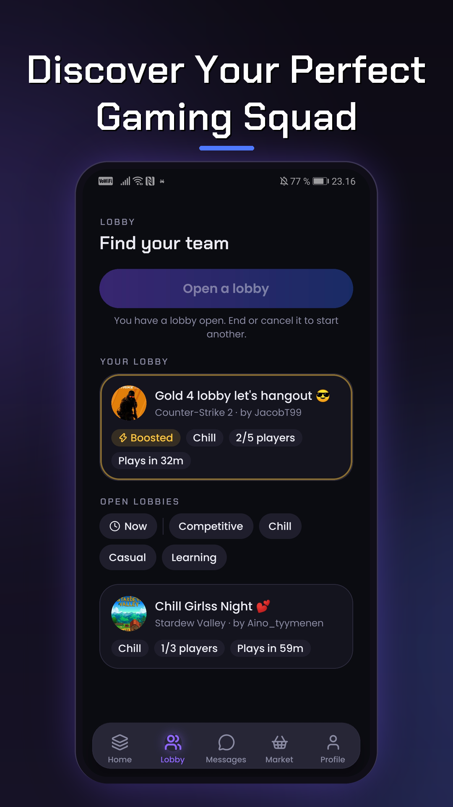
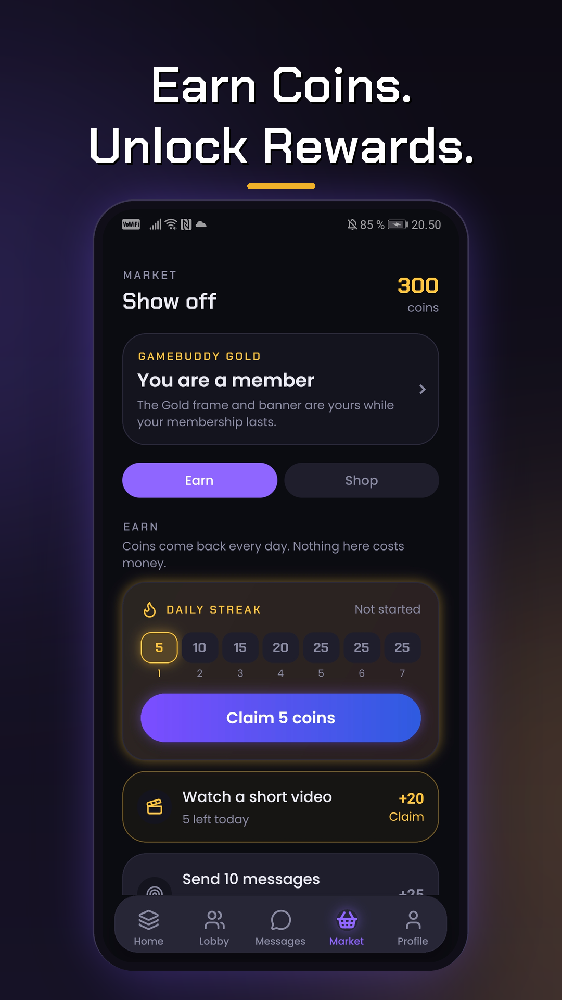

<div align="center">


# GameBuddy

**Find people to actually play with — matched on the games you own, the platform you're on, and how you like to play.**

Not a server list. Not a Discord you'll never open again. You swipe through real players, and the ones you both say yes to become someone you can message and get a game going with.

[](https://findgamebuddy.com)
[](https://findgamebuddy.com)


</div>

---

## What this is

GameBuddy is a full, shipped product built by one person — mobile app, backend, a machine-learning recommender, a marketing site, and the infrastructure under all of it. It went through a real closed test with real players, shipped the changes they asked for over several rounds, and is now in front of the Play Store's production review.

The pitch is simple: matchmaking for *people*, not lobbies. Tell it what you play and how, swipe a deck of real profiles ranked by how well they actually fit you, and when two people match, a private chat opens. There are lobbies for "who's up for ranked at 9", a Super Like for when you really mean it, verified Discord on profiles, badges and streaks, and a cosmetics shop — but the core loop is match, chat, go play.

This repository is the whole thing, end to end.

<div align="center">







<sub>Discover · Match · Chat · Lobbies · Market</sub>

</div>

---

## What's inside the loop

- **A deck worth swiping.** Profiles are ranked by a Python recommender trained on how you and they actually overlap — the games, the platforms, the play styles — not by who happens to be nearby.
- **Platform-aware matching.** Two people with identical libraries on different boxes can't actually play together, and the ranking knows it.
- **Chat that stays private.** Message bodies are encrypted at rest — the database stores ciphertext, not your conversation.
- **Lobbies & LFG.** Open a lobby for a game and a time, or ask to join someone else's. Every lobby has its own chat.
- **Sign in your way.** Email, Google, or Discord — and Discord links stay verified on your profile so nobody can wear your name.
- **Earn and spend.** Missions, badges, and a daily streak pay out coins; the shop turns them into card themes, frames, and banners.
- **Moderated and adults-only.** Every photo is screened before anyone sees it, reports are reviewed, a profanity filter covers all seven languages, and it's 18+ checked against a date of birth.

---

## Built with

| Layer | Stack |
|---|---|
| **Mobile** | React Native · Expo SDK 57 · TypeScript · Reanimated · TanStack Query · Zustand |
| **Backend** | Java 25 · Spring Boot 4.1 · a modular monolith (9 modules, boundaries enforced by ArchUnit) |
| **Matching** | Python 3.12 · FastAPI · a content-similarity recommender |
| **Data & realtime** | PostgreSQL · Redis (STOMP fan-out + presence) |
| **Web** | Astro · Tailwind — static, and it scores 99/100/100/100 on Lighthouse |
| **Infra** | Docker Compose · Caddy · structured JSON logs · a single Hetzner box |

---

## How it fits together

```
GameBuddy-App  ──►  backend (Spring Boot)  ──►  PostgreSQL
 (React Native)          │
                         └──►  model (FastAPI)   ranking only, no database access
```

The backend is a **modular monolith**: one thing to deploy, nine modules inside it, and the boundaries between them are checked by tests rather than left to good intentions. It started life as five separate microservices — everything that used to be an HTTP hop between them is now a method call. The recommender is the only piece kept out-of-process, because it's a different runtime; everything it needs travels over one small internal API.

There's a longer, honest write-up of the parts that actually bite — the database, the moderation console, billing webhooks, running more than one backend — in **[docs/ENGINEERING.md](docs/ENGINEERING.md)**.

---

## Run it locally

You need Docker. That's the whole prerequisite.

```bash
cp .env.example .env
docker compose up --build
```

That brings up Postgres, the model, the backend, Redis and Caddy; creates the schema; seeds the game and keyword catalogue; and waits for each service to report healthy before starting the next.

| Service | URL |
|---|---|
| Backend | http://localhost:8080 |
| API docs (Swagger) | http://localhost:8080/swagger-ui/index.html |
| Model | http://localhost:8000/health |

> **Signing up locally:** there's no mail server, so verification codes are printed to the backend log instead of emailed. Register, then `docker compose logs backend | grep "verification code"`. The full flow (and why it's built to fail closed) is in the [engineering notes](docs/ENGINEERING.md#logs).

Run the tests:

```bash
./gradlew build                          # backend + shared framework
cd GameBuddy-Model && python -m pytest   # recommender
```

---

## Repository layout

```
GameBuddy-App/         Mobile client — React Native, Expo (has its own README)
GameBuddy-backend/     Spring Boot modular monolith — Java 25, Boot 4.1
GameBuddy-Model/       Recommender + FastAPI service — Python 3.12
GameBuddy-Web/         findgamebuddy.com — Astro static site + legal pages
common/                Shared framework code used by the backend
badges/ · cosmetics/   Generators for the earned badges and shop art
store-listing/         Play Store copy, screenshots, and a listing validator
docs/                  Engineering notes and deeper reference
DEPLOY.md              How the production box is built and operated
```

Each sub-project has its own README with the details that matter there — start with **[GameBuddy-App](GameBuddy-App/README.md)** for the mobile side or **[GameBuddy-Web](GameBuddy-Web/README.md)** for the site.

---

## The honest bits

- **It's real, and it's a solo project.** GameBuddy is a bachelor's capstone, built and shipped by one person. The scope is deliberately larger than "an app" because the interesting part was making all the pieces — client, server, ML, site, ops — actually work together in production.
- **Android first.** iOS is designed for but not yet shipped; the code paths are there.
- **Some things are unfinished on purpose.** Google Play billing is exercised through RevenueCat's Test Store in debug builds and the functional suite; a real Play purchase needs an internal-testing-track install, so do one before relying on it. Notes like this live next to the code they're about, not buried here.
- **Everything in `.env.example` is a placeholder.** Production runs on its own secrets; nothing real is in this repository.

---

## License

The recommender (`GameBuddy-Model`) is MIT. The repository doesn't carry a single top-level license yet — if you're reading this because it just went public, that's the next thing worth adding.

<div align="center">
<sub>Built end to end by one person, in Finland. · <a href="https://findgamebuddy.com">findgamebuddy.com</a></sub>
</div>
